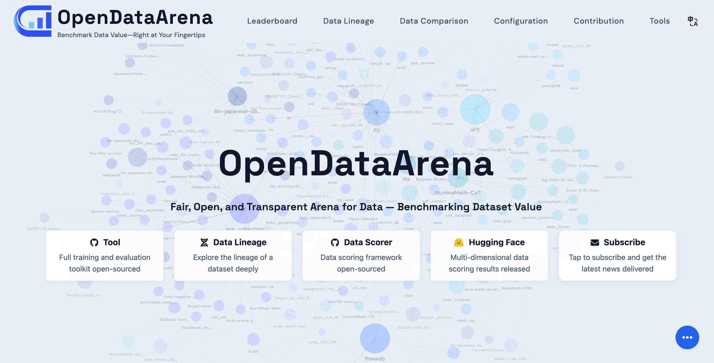
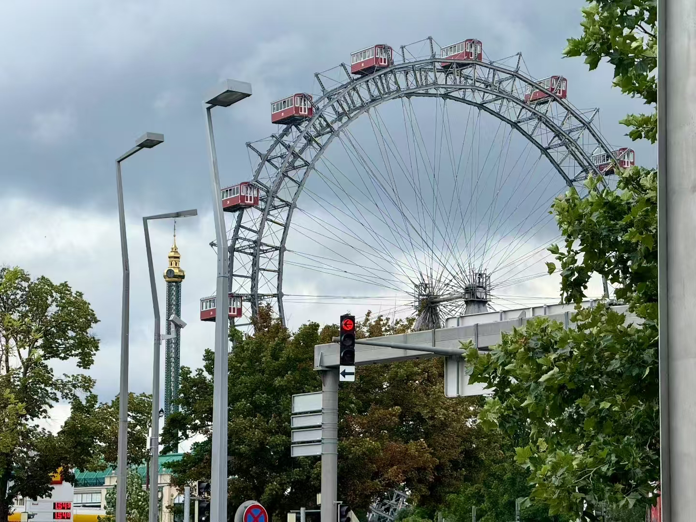
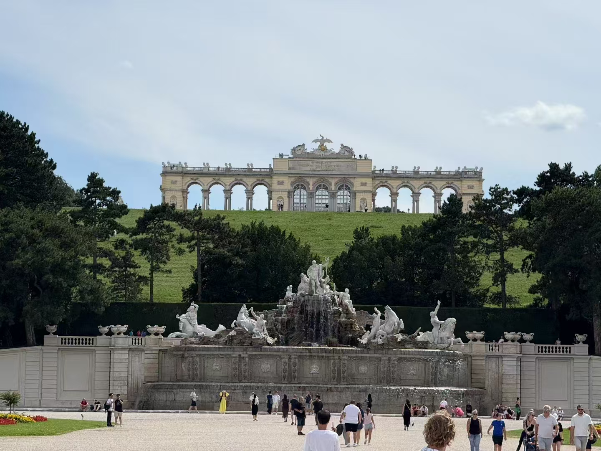
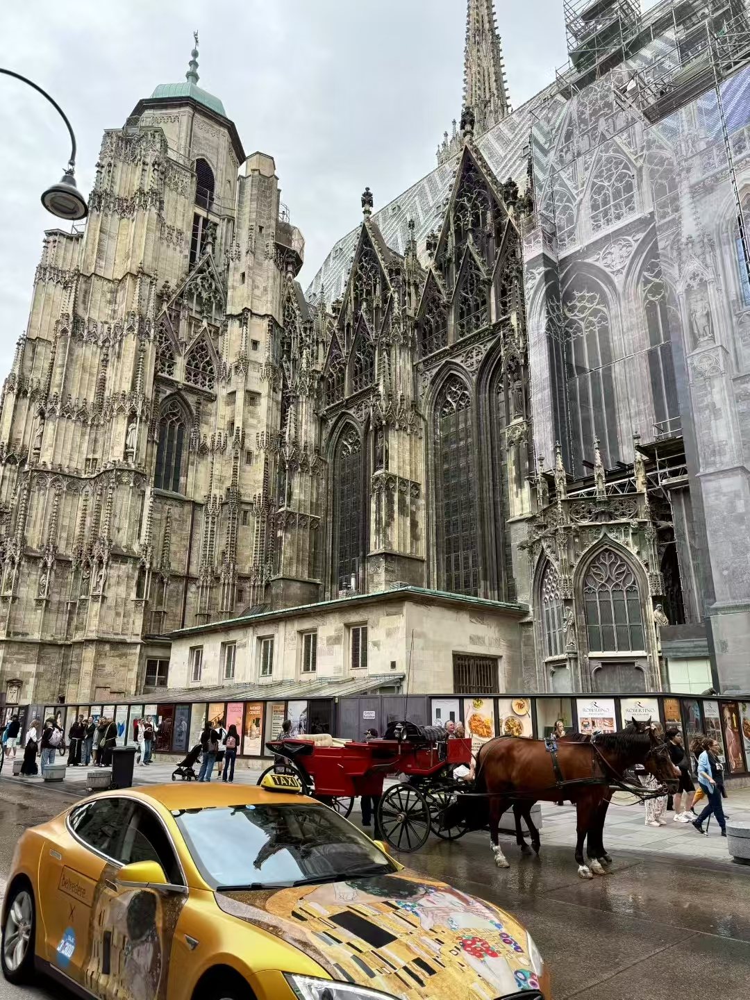
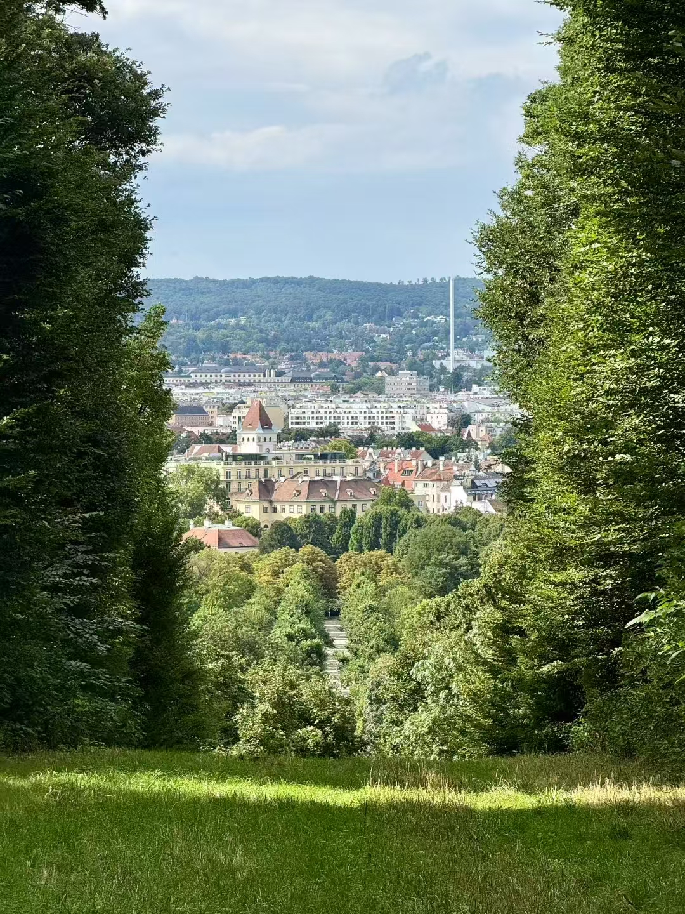
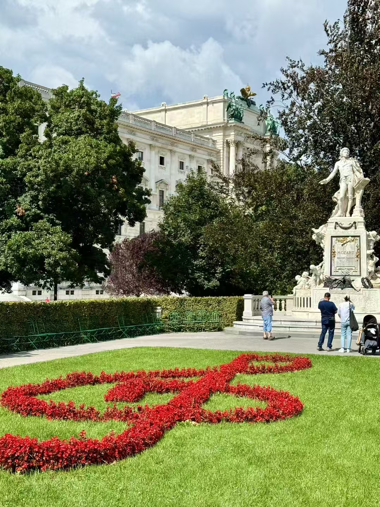
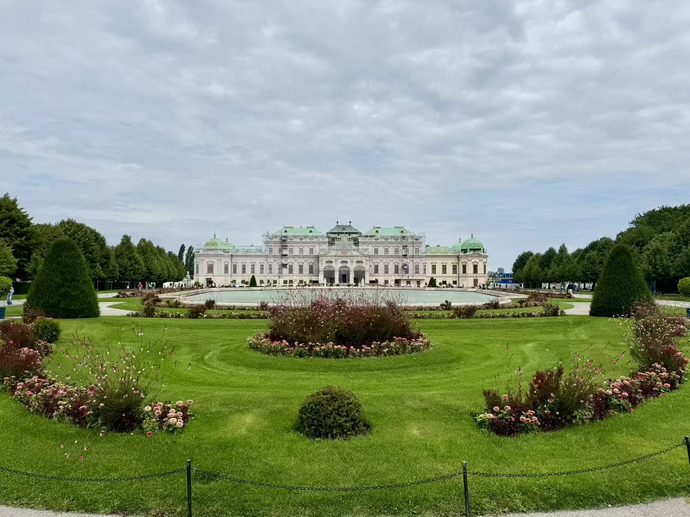








<!-- 

  
  

 -->

# 👋 About me

Hi, I’m Yu Li (LiYu), a first-year PhD student at the [University of Science and Technology of China (USTC)](https://en.ustc.edu.cn/), advised by [Lijun Wu](https://apeterswu.github.io/), [Feng Zhao](https://scholar.google.com/citations?user=r6CvuOUAAAAJ&hl=en), and [Dahua Lin](http://dahua.site/). My research focuses on data analysis for large language models, reasoning enhancement, and reinforcement learning.

I previously studied Information Security at Wuhan University (WHU) and conducted undergraduate research in the [NIS&P Lab](https://nisplab.whu.edu.cn/) under [Qian Wang](https://scholar.google.com/citations?hl=en&user=CD7ybnAAAAAJ).
I’m always happy to connect and discuss research ideas or potential collaborations—feel free to reach out.

<!-- 
# 🔥 News -->

# 📝 Publications 
- **Y. Li**, W. Li, X. Gao, M. Sun, X. Wang, Q. Pei, & L. Wu. SPARK: Skeleton-Guided Reasoning Synthesis from Large-Scale Scientific Literature. **Submitted to EMNLP 2026**
- M. Sun\*, **Y. Li\***, Z. Yu, S. Zhang, & W. Ye. Support Vector Rubrics: Closing the Gap Between Self-Generated and Human Rubrics. **Submitted to EMNLP 2026**
- **Y. Li**, X. Shang, Q. Pei, Y. Zhu, X. Gao, H. Lin, Z. Zhong, Z. Pan, Z. Liu, X. Wang, C. He, D. Lin, F. Zhao, & L. Wu. Tracing the Roots: A Multi-Agent Framework for Uncovering Data Lineage in Post-Training LLMs.  **Main of ACL 2026 · Oral🔥** [[Paper]](https://arxiv.org/abs/2604.10480)
- Z. Pan\*, Q. Pei\*, **Y. Li**, Q. Sun, Z. Tang, H. V. Zhao, C. He, & L. Wu. REST: Stress Testing Large Reasoning Models by Asking Multiple Problems at Once.  **Main of ACL 2026** [[Paper]](https://arxiv.org/abs/2507.10541)
- M. Sun\*, **Y. Li\***, Y. Liu, B. Du, & Y. Ge. InverTune: Removing Backdoors from Multimodal Contrastive Learning Models via Trigger Inversion and Activation Tuning. Network and Distributed
System Security (**NDSS**) Symposium 2026 **· Oral🔥** [[Paper]](https://www.ndss-symposium.org/ndss-paper/invertune-a-backdoor-defense-method-for-multimodal-contrastive-learning-via-backdoor-adversarial-correlation-analysis/)
- **Y. Li\***, Z. Pan\*, H. Lin\*, M. Sun, C. He, & L. Wu. Can one domain help others? a data-centric study on multi-domain reasoning via reinforcement learning. arXiv preprint arXiv:2507.17512 [[Paper]](https://arxiv.org/abs/2507.17512)
- Q. Pei\*, L. Wu\*, Z. Pan, **Y. Li**, H. Lin, C. Ming, X. Gao, C. He, & R. Yan. Mathfusion: Enhancing mathematical problem-solving of llm through instruction fusion. **Main of ACL 2025** [[Paper]](https://aclanthology.org/2025.acl-long.367/)
- **Y. Li**, Q. Pei, M. Sun, H. Lin, C. Ming, X. Gao, J. Wu, C. He, & L. Wu. Cipherbank: Exploring the boundary of LLM reasoning capabilities through cryptography challenges. **Findings of ACL 2025** [[Paper]](https://aclanthology.org/2025.findings-acl.309/)
- Z. Pan, **Y. Li**, H. Lin, Q. Pei, Z. Tang, W. Wu, C. Ming, H. V. Zhao, C. He, & L. Wu. Lemma: Learning from Errors for Mathematical Advancement in LLMs.  **Findings of ACL 2025** [[Paper]](https://aclanthology.org/2025.findings-acl.605/)

# 🔧 Projects
- *2025.04 - 2025.10*, OpenDataArena: Fair, Open, and Transparent Arena for Data — Benchmarking Dataset Value [[Project]](https://arena.opendatalab.org.cn/) [[Paper]](https://arxiv.org/abs/2512.14051)

  

# 📃 Awesome Repos
- 🔥[Awesome-AI-Research-Writing](https://github.com/Leey21/awesome-ai-research-writing) 
- [arxiv-translator](https://github.com/Leey21/arxiv-translator) 

# 🏆 Competition Awards
- **2nd Place.🎖**  Internal Reasoning in the NeurIPS 2025 CURE-Bench Competition *2025.10*
- **Third Prize.** C/C++ Programming at the 15th National LanQiao Cup Competition Software Competition *2024.06*
- **First Prize.🎖** University Group A in C/C++ Programming at the 15th LanQiao Cup Competition Software Competition in Hubei *2024.04*
- **Second Prize.**  China Undergraduate Mathematical Contest in Modeling *2023.09*
- **First Prize🎖.** The 16th NATIONAL COLLEGE STUDENT INFORMATION SECURITY CONTEST *2023.08*
- **First Prize.🎖** The 15th "Huazhong Cup" College Student Mathematical Modeling Challenge *2023.05*
- **Meritorious Winner.🎖** 2023 Mathematical Contest In Modeling *2023.04*
- **First Prize.🎖** 2023 "Huashu Cup" International Mathematical Contest in Modeling *2023.02*
- **Second Prize.** The 14th National College Student Mathematics Competition in Hubei Division *2022.11*
- **Second Prize.** The 3rd Whu CARTOVISION Map Design Competition *2022.10*

# 🥇 Scholarships and Honors
- *2024.09* **National Scholarship** (Award Rate: 0.2% national-wide) *Ministry of Education, China*
- *2023.09* **National Scholarship** (Award Rate: 0.2% national-wide) *Ministry of Education, China* 
- *2022.09* **National Scholarship** (Award Rate: 0.2% national-wide) *Ministry of Education, China*
- *2024.10* **Merit Student** (Award Rate: 10% school-wide) *Wuhan University*
- *2023.10* **Merit Student** (Award Rate: 10% school-wide) *Wuhan University*
- *2022.10* **Merit Student** (Award Rate: 10% school-wide) *Wuhan University*
- *2025.06* **Outstanding Graduate** *Wuhan University*
- *2025.05* **Outstanding Undergraduate Thesis** *Wuhan University*
- *2023.12* **First Prize for Advanced Individual in Learning** (Award Rate:GPA Top Three) *School of Cyber Science and Engineering*
- *2023.12* **Advanced individuals in scientific and technological innovation** *School of Cyber Science and Engineering*
- *2023.10* **First Class Scholarship of WHU** (Award Rate: 5% school-wide) *Wuhan University*
- *2022.09* **Second Class Scholarship of WHU** (Award Rate: 10% school-wide) *Wuhan University*
  

# 📖 Educations
- *2025.09 - now*, Ph.D. Student, University of Science and Technology of China (USTC), Hefei, Anhui, China.
- *2021.09 - 2025.06*, Undergraduate, Wuhan University (WHU), Wuhan, Hubei, China.
- *2018.09 - 2021.06*, Senior Middle School, Zhengzhou No. 7 Middle School, Zhengzhou Henan.
- *2015.09 - 2018.06*, Junior Middle School, High-tech Zone Experimental Middle School, Zhengzhou Henan.

# 💻 Internships

  

    
  

  

    

      <h3 class="internship-title"><a href="https://www.shlab.org.cn/">Shanghai AI Laboratory</a></h3>
    

    

      <i class="far fa-calendar-alt"></i>Oct 2024 - May 2026
      <i class="far fa-user"></i>Supervised by <a href="https://apeterswu.github.io/">Lijun Wu</a>
    

  

# 🌍 Travel

  

    <button class="travel-orbit-photo" type="button" style="--i: 0;" data-index="0" data-src="../images/travel/Vienna/1.jpg" aria-label="View Vienna travel photo 1"></button>
    <button class="travel-orbit-photo" type="button" style="--i: 1;" data-index="1" data-src="../images/travel/Vienna/2.jpg" aria-label="View Vienna travel photo 2"></button>
    <button class="travel-orbit-photo" type="button" style="--i: 2;" data-index="2" data-src="../images/travel/Vienna/3.jpg" aria-label="View Vienna travel photo 3"></button>
    <button class="travel-orbit-photo" type="button" style="--i: 3;" data-index="3" data-src="../images/travel/Vienna/4.jpg" aria-label="View Vienna travel photo 4"></button>
    <button class="travel-orbit-photo" type="button" style="--i: 4;" data-index="4" data-src="../images/travel/Vienna/5.jpg" aria-label="View Vienna travel photo 5"></button>
    <button class="travel-orbit-photo" type="button" style="--i: 5;" data-index="5" data-src="../images/travel/Vienna/6.jpg" aria-label="View Vienna travel photo 6"></button>
    <button class="travel-orbit-photo" type="button" style="--i: 6;" data-index="6" data-src="../images/travel/Vienna/7.jpg" aria-label="View Vienna travel photo 7"></button>
  

  

    <strong>Vienna</strong>
    Austria
  

  

    <button class="travel-orbit-photo" type="button" style="--i: 0;" data-index="0" data-src="../images/travel/Los Angeles/1.jpg" aria-label="View Los Angeles travel photo 1"></button>
    <button class="travel-orbit-photo" type="button" style="--i: 1;" data-index="1" data-src="../images/travel/Los Angeles/2.jpg" aria-label="View Los Angeles travel photo 2"></button>
    <button class="travel-orbit-photo" type="button" style="--i: 2;" data-index="2" data-src="../images/travel/Los Angeles/3.jpg" aria-label="View Los Angeles travel photo 3"></button>
    <button class="travel-orbit-photo" type="button" style="--i: 3;" data-index="3" data-src="../images/travel/Los Angeles/4.jpg" aria-label="View Los Angeles travel photo 4"></button>
    <button class="travel-orbit-photo" type="button" style="--i: 4;" data-index="4" data-src="../images/travel/Los Angeles/5.jpg" aria-label="View Los Angeles travel photo 5"></button>
    <button class="travel-orbit-photo" type="button" style="--i: 5;" data-index="5" data-src="../images/travel/Los Angeles/6.jpg" aria-label="View Los Angeles travel photo 6"></button>
  

  

    <strong>Los Angeles</strong>
    California, USA
  

  

    <button class="travel-orbit-photo" type="button" style="--i: 0;" data-index="0" data-src="../images/travel/Salt Lake City/1.jpg" aria-label="View Salt Lake City travel photo 1"></button>
    <button class="travel-orbit-photo" type="button" style="--i: 1;" data-index="1" data-src="../images/travel/Salt Lake City/2.jpg" aria-label="View Salt Lake City travel photo 2"></button>
    <button class="travel-orbit-photo" type="button" style="--i: 2;" data-index="2" data-src="../images/travel/Salt Lake City/3.jpg" aria-label="View Salt Lake City travel photo 3"></button>
    <button class="travel-orbit-photo" type="button" style="--i: 3;" data-index="3" data-src="../images/travel/Salt Lake City/4.jpg" aria-label="View Salt Lake City travel photo 4"></button>
    <button class="travel-orbit-photo" type="button" style="--i: 4;" data-index="4" data-src="../images/travel/Salt Lake City/5.jpg" aria-label="View Salt Lake City travel photo 5"></button>
    <button class="travel-orbit-photo" type="button" style="--i: 5;" data-index="5" data-src="../images/travel/Salt Lake City/6.jpg" aria-label="View Salt Lake City travel photo 6"></button>
    <button class="travel-orbit-photo" type="button" style="--i: 6;" data-index="6" data-src="../images/travel/Salt Lake City/7.jpg" aria-label="View Salt Lake City travel photo 7"></button>
    <button class="travel-orbit-photo" type="button" style="--i: 7;" data-index="7" data-src="../images/travel/Salt Lake City/8.jpg" aria-label="View Salt Lake City travel photo 8"></button>
  

  

    <strong>Salt Lake City</strong>
    Utah, USA
  

  <button class="travel-lightbox-close" type="button" aria-label="Close travel photo">&times;</button>
  <button class="travel-lightbox-nav travel-lightbox-prev" type="button" aria-label="Previous travel photo">&#8249;</button>
  
  <button class="travel-lightbox-nav travel-lightbox-next" type="button" aria-label="Next travel photo">&#8250;</button>

<!--
# 💬 Invited Talks
- *2021.06*, Lorem ipsum dolor sit amet, consectetur adipiscing elit. Vivamus ornare aliquet ipsum, ac tempus justo dapibus sit amet. 
- *2021.03*, Lorem ipsum dolor sit amet, consectetur adipiscing elit. Vivamus ornare aliquet ipsum, ac tempus justo dapibus sit amet.  \| [\[video\]](https://github.com/)

# 💻 Internships
- *2019.05 - 2020.02*, [Lorem](https://github.com/), China. -->
